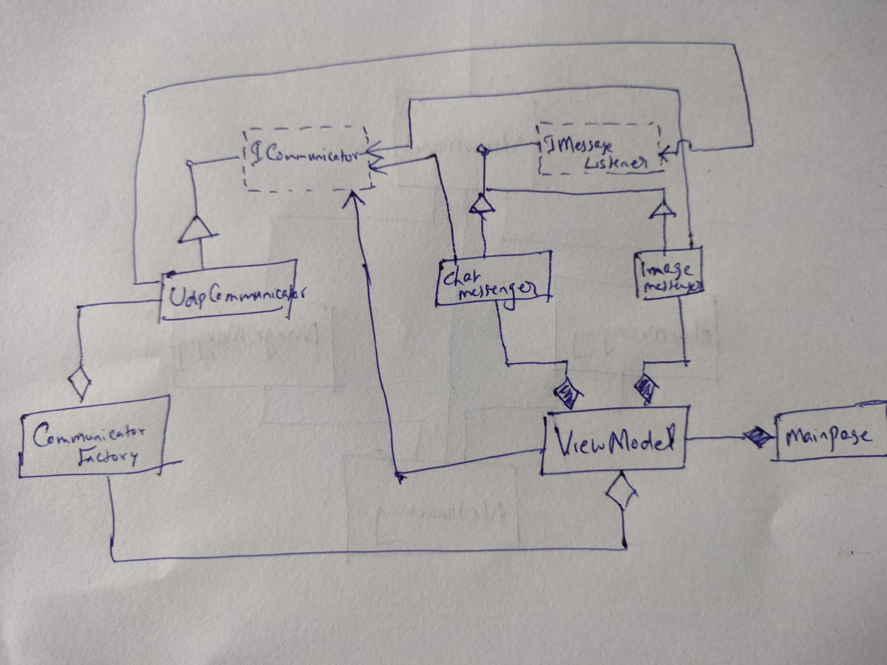
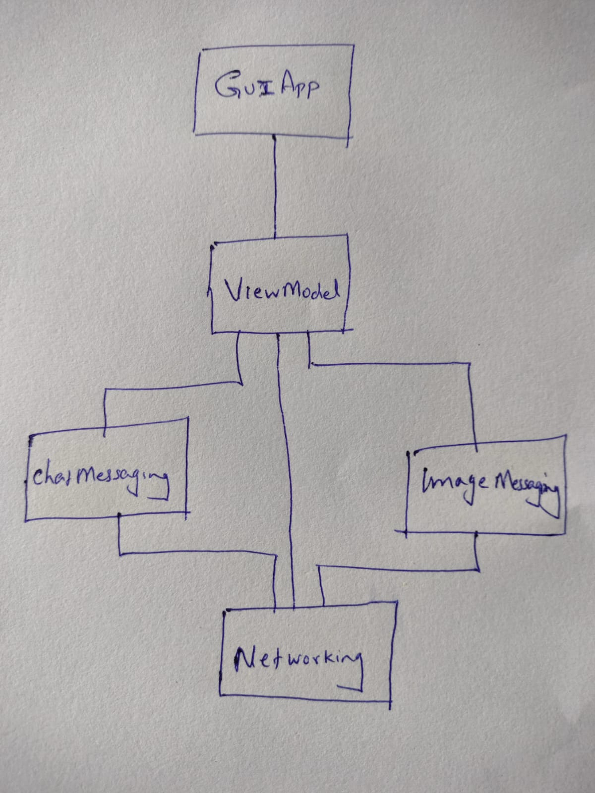

# Overview

This repository contains a Java implementation of a distributed GUI demo application showcasing MVVM architecture, networking with UDP, and messaging capabilities for both chat and images. This project is built based on the original .NET application available at: https://github.com/chittur/distributed-and-gui-demo

The application demonstrates a distributed system where multiple instances can communicate over a network using UDP. It supports sending and receiving text messages and images, with a GUI interface to interact with the system. The implementation follows the Model-View-ViewModel (MVVM) design pattern to separate concerns between the UI and business logic, alongside other patterns like factory and observer for creating communicators and handling messages.

# Design
These are the modules in this project

- **networking**

This module defines the types required to send and receive data across process/machine boundaries.
 - *UdpCommunicator*: A class that communicates via the UDP protocol.
   - This is a *serialized messaging passing* model as opposed to an *inter-object communication* model like RPC or Java RMI. This implies that the module needs to serialize the data before sending it as bytes. On the receiving end, the data is deserialized, and the original message recreated. While the serialization and conversion to-and-from bytes are handled by the networking layer, it has the benefit that the networking module is agnostic to the type of the message. It just sends and receives messages. The messages themselves are processed by higher level modules that care about the format and the details of the message.
   - UDP is a less reliable protocol than TCP. But we are going with UDP here to keep this simple for a demo program.
 - *CommunicatorFactory*: This class uses the *factory pattern* to abstract away the details of the communicator implementation from its clients.
 - *IMessageListener Interface*: This interface lets clients subscribe for notifications from the communicator. If the communicator receives a message meant for a particular client, the client can register for callback notification from the communicator via this interface. We use the *Publisher-Subscriber* design pattern here.

- **chatmessaging**
This is a simple demonstration of a *processing module*, one that processes data. In this case, this module handles chat messages passed to it from the UX layer, and sends them over to the communication layer. It also subscribes for notifications from the communication layer. You could imagine a lot more involved design for a more substantial project; with metadata, storage, and analysis capabilities. In this case, we are keeping the module simple given it is a demo project.

- **imagemessaging**
This module is similar to the chatmessaging module, except that it processes image messages instead of chat messages. It handles large image data by implementing a chunking mechanism to split images into smaller UDP packets and reassemble them on the receiving end, ensuring reliable delivery even when packets arrive out of order.

- **viewmodel**
We are using the Model-View-ViewModel (MVVM) design pattern for our User Experience layer, and this module serves as the ViewModel component of this architecture. It provides data binding properties and handles the business logic between the View and the messaging modules.

- **gui**
This module is the *View* of our User Experience layer, and defines its JavaFX-based GUI. It includes the main window controller and FXML layout files that define the user interface for sending and receiving messages and images.

- **Tests**
This module defines unit tests, integration tests and end-to-end tests for this project, ensuring code quality and functionality across all components.

## Project Structure

- **src/main/java/com/example/distributedguidemojava/**: Contains the Java project with JavaFX for the GUI.
  - Key packages include `gui` (UI), `networking` (UDP communication), `chatmessaging` (text messaging), `imagemessaging` (image handling), and `viewmodel` (business logic).
- **src/test/java/**: Contains unit tests for the application.
- **pom.xml**: Maven build configuration file.
- **Images/**: Contains diagrams and visual resources relevant to the project (e.g., class diagrams, module diagrams).
- **CONTRIBUTING.md**: Guidelines for contributing to this repository.
- **License.txt**: Licensing information for the project.

## Getting Started

### Java Implementation
1. **Prerequisites**: Ensure you have JDK 17 or later installed (download from https://www.oracle.com/java/technologies/javase-jdk17-downloads.html or https://adoptium.net/) and Maven installed (download from https://maven.apache.org/download.cgi). Set the `JAVA_HOME` environment variable and ensure `mvn` is in your PATH.
2. **Build**: Navigate to the project root in a terminal or command prompt and run `mvn clean install` to compile and download dependencies.
3. **Run**: 
   - **Development**: Launch with `mvn javafx:run` for development
   - **Production**: Build executable JAR with `mvn package` then run `java -jar target/distributed-gui-demo-java-1.0-SNAPSHOT.jar`
4. **Testing**: Run unit tests with `mvn test` to execute the test suite located in `src/test/java/`.
5. **Coverage**: Generate code coverage reports with `mvn test jacoco:report` for JaCoCo coverage analysis and Azure DevOps visualization.
6. **IDE Support**: Import the project into IntelliJ IDEA or Eclipse by opening the `pom.xml` file for easier development and testing.

### Azure DevOps Pipeline
The project includes an Azure DevOps pipeline (`azure-pipelines.yml`) that:
- ✅ Compiles and packages the application
- ✅ Runs all unit tests with comprehensive coverage
- ✅ Enforces code style with Checkstyle
- ✅ Generates JaCoCo coverage reports with real line numbers
- ✅ Publishes test results and interactive coverage visualization
- ✅ Creates downloadable build artifacts

#### Self-Hosted Agent Setup
The pipeline is configured for self-hosted agents and uses native JaCoCo coverage reporting. JaCoCo provides accurate line numbers and coverage data directly from your source code without any conversion needed.

No additional dependencies are required - the pipeline works out of the box with Java and Maven.

## Diagrams

### Class Diagram

*Illustrates the class structure for the application.*

### Module Diagram

*Shows the modular architecture of the system.*

## License

This project is licensed under the terms specified in `License.txt`.

## Contributing

Please read `CONTRIBUTING.md` for details on how to contribute to this project.
